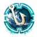

<!-- Improved compatibility of back to top link: See: https://github.com/othneildrew/Best-README-Template/pull/73 -->

<!--
*** Thanks for checking out the Best-README-Template. If you have a suggestion
*** that would make this better, please fork the repo and create a pull request
*** or simply open an issue with the tag "enhancement".
*** Don't forget to give the project a star!
*** Thanks again! Now go create something AMAZING! :D
-->

<!-- PROJECT LOGO -->
 

  

<h3 align="center">GW2 Fisher</h3>

  

    A utility for displaying and tracking fishing achievements for GW2.
     
    <a href="https://ritlew.github.io/gw2-fisher">Start using it now!</a>
    ·
    <a href="https://github.com/ritlew/gw2-fisher/issues">Report Bug</a>
    ·
    <a href="https://github.com/ritlew/gw2-fisher/issues">Request Feature</a>
  

<!-- ABOUT THE PROJECT -->
## About The Project
I was working on my fishing achievements but got extemely tired of opening the hero panel over and over to check my progress and fish information. I wanted an complete display of the my fishing progress as well as what bait, hole, and time I needed for the rest of my achievement progress. Thus I created this application to both display the relevant information as well as track my current progress.

(<a href="#readme-top">back to top</a>)

<!-- GETTING STARTED -->
## Getting Started

Simply navigatee to https://ritlew.github.io/gw2-fisher/ and select the collection you're working on. You can now see the relevant information for catching fish and mark them as caught the first tiem you catch each one. The collection view helps compare the information against your achievement panel.

(<a href="#readme-top">back to top</a>)

<!-- CONTRIBUTING -->
## Contributing

Contributions are what make the open source community such an amazing place to learn, inspire, and create. Any contributions you make are **greatly appreciated**.

If you have a suggestion that would make this better, please fork the repo and create a pull request. You can also simply open an issue with the tag "enhancement".
Don't forget to give the project a star! Thanks again!

1. Fork the Project
2. Create your Feature Branch (`git checkout -b feature/AmazingFeature`)
3. Commit your Changes (`git commit -m 'Add some AmazingFeature'`)
4. Push to the Branch (`git push origin feature/AmazingFeature`)
5. Open a Pull Request

### Built With

[![React][React.js]][React-url]
[![Chakra][Chakra UI]][Chakra-ui-url]

(<a href="#readme-top">back to top</a>)

<!-- CONTACT -->
## Contact

Discord: ritlew#5260 -- Send me a message if you'd prefer to discuss things on discord

Otherwise create an issue on the [issues page](https://github.com/ritlew/gw2-fisher/issues)

(<a href="#readme-top">back to top</a>)

<!-- MARKDOWN LINKS & IMAGES -->
<!-- https://www.markdownguide.org/basic-syntax/#reference-style-links -->
[contributors-shield]: https://img.shields.io/github/contributors/github_username/repo_name.svg?style=for-the-badge
[contributors-url]: https://github.com/github_username/repo_name/graphs/contributors
[forks-shield]: https://img.shields.io/github/forks/github_username/repo_name.svg?style=for-the-badge
[forks-url]: https://github.com/github_username/repo_name/network/members
[stars-shield]: https://img.shields.io/github/stars/github_username/repo_name.svg?style=for-the-badge
[stars-url]: https://github.com/github_username/repo_name/stargazers
[issues-shield]: https://img.shields.io/github/issues/github_username/repo_name.svg?style=for-the-badge
[issues-url]: https://github.com/github_username/repo_name/issues
[license-shield]: https://img.shields.io/github/license/github_username/repo_name.svg?style=for-the-badge
[license-url]: https://github.com/github_username/repo_name/blob/master/LICENSE.txt
[linkedin-shield]: https://img.shields.io/badge/-LinkedIn-black.svg?style=for-the-badge&logo=linkedin&colorB=555
[linkedin-url]: https://linkedin.com/in/linkedin_username
[product-screenshot]: images/screenshot.png

[React.js]: https://img.shields.io/badge/React-20232A?style=for-the-badge&logo=react&logoColor=61DAFB
[React-url]: https://reactjs.org/
[Chakra UI]: https://img.shields.io/badge/Chakra-171923?style=for-the-badge&logo=chakra-ui&logoColor=319795
[Chakra-ui-url]: https://chakra-ui.com/
